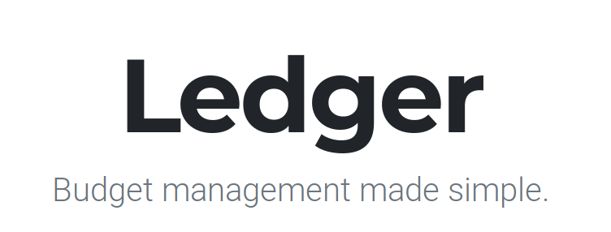

Ledger is a web application designed for enterprise budget management. As its features may not be suited to all use cases, you are encouraged to modify it for the needs of your own project. You are welcome to redistribute the modified software so long as the license is preserved.

## Installing
Clone this repository into your Django project directory and add 'Ledger' to `INSTALLED_APPS` in settings.py. The following dependencies should already be installed, but if required install via [pip](https://pypi.org/project/pip/) to your system or virtual environment (recommended).
#### Dependencies
+ Django 2.2.2
`pip install Django==2.2.2`

+ pytz
`pip install pytz==2019.1`

+ sqlparse
`pip install sqlparse==0.3.0`
